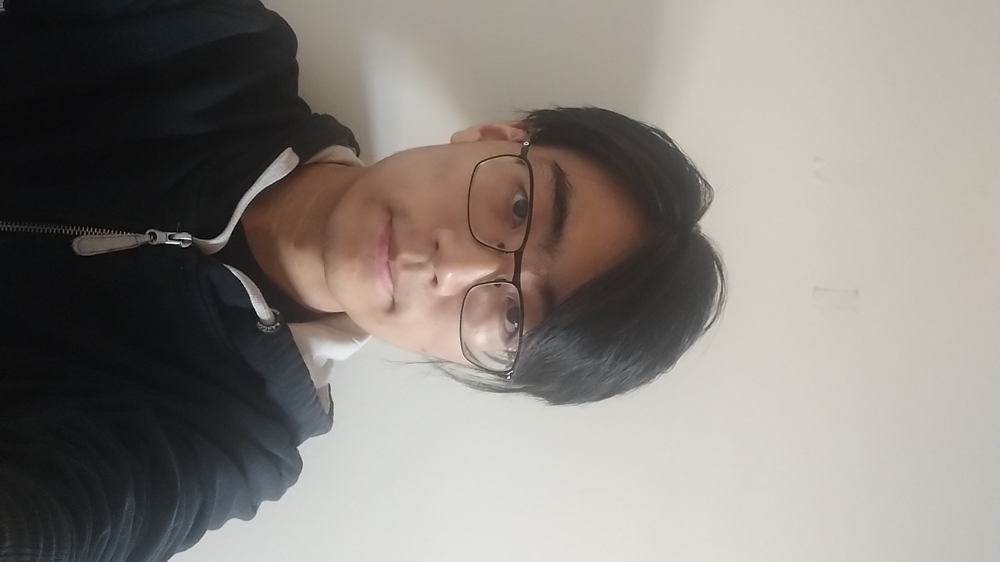

### Hello, I'm Alex, Nice to meet you!

::: {.column-margin}

:::

I'm a student in the Masters of Data Science (Computational Linguistics) program at UBC, looking to broaden their horizons with up-to-date trends in AI. I come from a Computer Science background, and am hoping to get the necessary skillset for the Data Science field. I cook, bake, and do gardening in my spare time.

